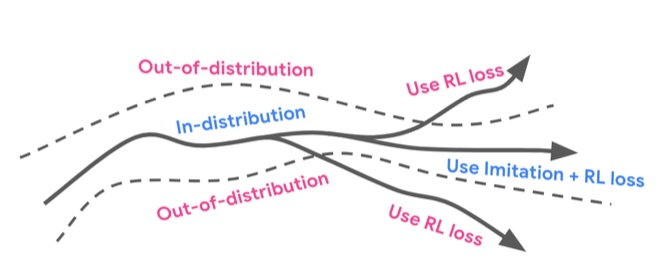
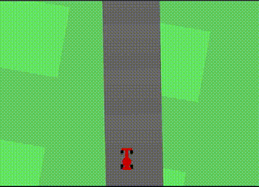

BC-SAC
========

### [Work in progress]

## Overview

This is a simplified implementation of the imitation with reinforcement learning described in [Imitation Is Not Enough: Robustifying Imitation with Reinforcement Learning for Challenging Driving Scenarios](https://arxiv.org/abs/2212.11419). It operates on the Car Racing environment in Gymnasium.

Imitation learning is good at following expert behavior, but struggles when you go out of distribution (covariate shift). Reinforcement learning is good at respecting explicit rewards. The idea is to combine the two, so when you go out of distribution (eg, off road) the RL kicks in.

So far this implementation includes:
1. Collect expert data by playing as a human. Just a couple laps can train a very successful IL policy.
2. Rather than training the IL and RL policies together, this code pre-trains with behavior cloning then finetunes with RL.
   * This is simlar to [Scaling Is All You Need: Autonomous Driving with JAX-Accelerated Reinforcement Learning](https://arxiv.org/abs/2312.15122).
   * Like that paper, it pre-trains both the policy and Q networks on expert data.
3. The RL implementation right now is actually DDPG with a double-Q function. This is close to TD3 (minus a couple tricks). Upgrading to SAC would involve making the policy stochastic and adding entropy regularization.

## Results

The BC policy trained on just a few laps is pretty good but sometimes goes off road and then loses control (none of the expert demonstrations went significantly off road). It gets an average reward of 315 on test tracks not seen during training (with a negative reward added for going off the track). Interestingly, slowing it down just a bit by adding some braking improves the results dramatically.

<!-- <video src=".github/bc_policy.mp4" controls="controls" style="max-width: 20%;">
    Your browser does not support the video tag.
</video> -->

The RL component, when trained with negative reward for going off the track, should improve these scenarios.

## Usage

Collect expert data with:

`python main.py human`

Replay the expert trajectories with:

`python main.py replay`

Pre-train a BC policy with:

`python main.py train_bc`

Fine-tune a RL policy with:

`python main.py train_rl --resume_run_id=[run ID of the BC policy]`

(You can also train a RL policy from scratch by leaving out the run ID, though this requires significant hyperparameter tuning.)

Test a policy with:

`python main.py test --resume_run_id=[run ID]`

Losses and metrics are logged to Tensorboard.

`tensorboard --logdir logs/ --bind_all`

## TODO
- [ ] Unify env stepping code and rewards across IL, RL, and testing.
- [ ] Upgrade to SAC and make the RL baseline more robust
- [ ] Parallelize agents
- [ ] Multi-gpu learning
